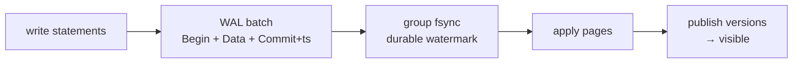

# How does this work?

## How does a SELECT work?

Parse → `execute_select` (single-table fast path or general join engine) → snapshot scan → `evaluate_expression/evaluate_predicate` per row → project → aggregate/group/window → order/limit → rows. `COUNT(*)` without `WHERE` shortcuts to key count. Time predicates normalized for zone-map pruning.

## How does an INSERT work?

Parse `VALUES|SELECT|DEFAULT` → materialize source (join engine for `SELECT`) → `execute_insert_rows` → enforce constraints/defaults → WAL `Data(Put)` + buffer → commit fsync → apply pages → install MVCC versions → `Inserted(n)` or `RETURNING` rows. `ON CONFLICT` checks unique gates/B-tree first.

## How do UPDATE / DELETE work?

Locate visible rows under snapshot → evaluate `SET`/`WHERE` → stage new versions/tombstones → same commit path. `UPDATE…FROM`/`DELETE…USING` materialize the joined relation first (autocommit only for `UPDATE…FROM`).

## How does JSON access work?

`->/->>` navigate decoded `JsonbValue`; `#>/@>` lower to path/contains functions; `JSON_TABLE` projects row/column specs via `ExpressionEval`; subscripts compile to `JsonSubscript/ArrayIndex`.

## How does an index get used?

Executor encodes SQL key → bytes → B-tree `lookup/range_scan` or ART `lookup`; RowIds resolved under MVCC visibility; unique writes reserve transient gates but B-tree remains authority.

## How does a transaction work?

[MVCC](/v0.1.0/transactions/mvcc) + [Behavior contracts](/v0.1.0/transactions/behavior-contracts): Begin(snapshot+WAL Begin) → buffer(Data) → Commit(ts+fsync+publish) or Abort.

## How does data reach disk?

Buffer pool write-through on evict → `sync` + fsync; WAL fsync always first; checkpoint publishes generation + reclaims segments.

## How does recovery work?

[WAL / checkpoints / recovery](/v0.1.0/storage/wal-checkpoints-recovery): validate → select checkpoint → replay after boundary → reconstruct → Ready.
