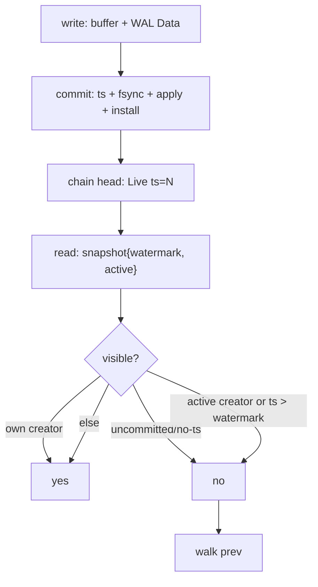
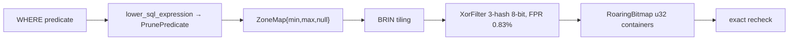

# MVCC and filtering — deep dive

## MVCC working (`crates/mvcc`)

`RowVersion{creator, commit_ts?, state, payload?, prev}` newest-first chains in `BTreeMap<key, Vec<RowVersion>>`.

`visible_or_unknown`: `None` → storage fallback (pre-MVCC bootstrap `TxnId(0),ts0`), `Some(None)` → deleted/invisible, `Some(Some)` → payload. `gc(horizon=min(active) else last)` keeps uncommitted + `ts>horizon` + newest `ts<=horizon` floor per chain. Engine `SharedVersionStore + versions_complete` (mount `bootstrap_versions`, maintained by `install_committed`); reads page `SCAN_CHUNK_ROWS=1024` under fixed snapshot.

## Filtering pipeline (`crates/filters`, `columnar/pruning`)

Rule: **PRUNE only if metadata proves no match; missing/uncertain/malformed → KEEP**. XOR never authoritative (`true` → exact). Roaring `Array(≤4095)/Bitmap/Run` auto-convert, deterministic `PLRB v1 + CRC`. Placement `shared/filters/`, rebuilt at flush; no filter WAL/MVCC. Time predicates normalized before lowering (`normalize_time_pruning_expression`).

**Related:** [MVCC](/v0.1.0/transactions/mvcc) · [Columnar](/v0.1.0/storage/columnar) · [Behavior contracts](/v0.1.0/transactions/behavior-contracts)
