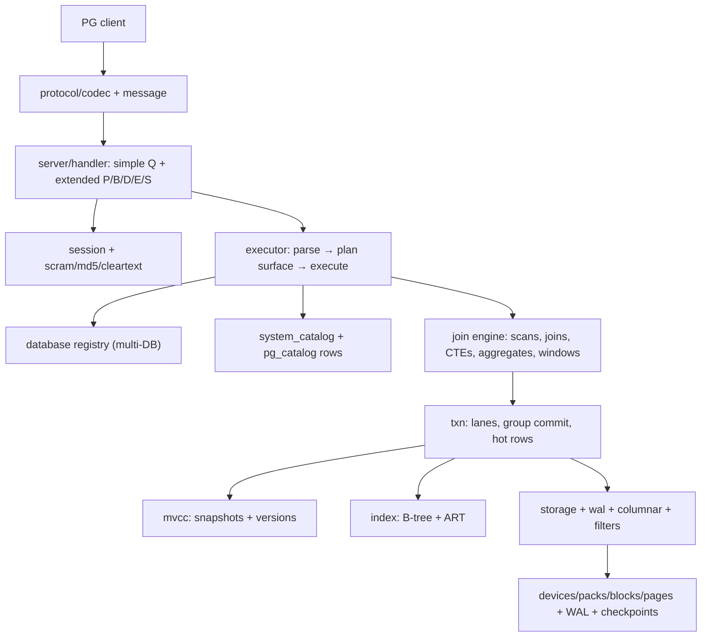

# Architecture overview

Crates: `core types sql optimizer(stub) executor network server txn mvcc storage wal index columnar filters json lifecycle security(foundations) cli crc32c`. Rule: own the engine (`deny.toml` forbids PG/RocksDB/ClickHouse/DuckDB foundations).

**Deeper:** [Request lifecycle](/v0.1.0/architecture/request-lifecycle) · [Query pipeline](/v0.1.0/architecture/query-pipeline) · [How it works](/v0.1.0/architecture/how-it-works)
