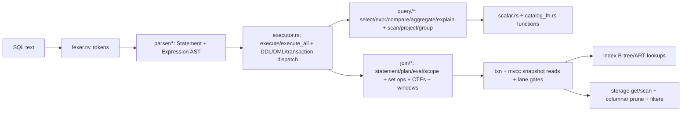

# Query pipeline

- SQL → `Parser::new(tokens, catalog).parse_statements()` (multi-word types, `TYPE[]`, `(n,m)` preserved).
- No cost planner: `crates/optimizer` is foundations-only; `EXPLAIN` describes shapes.
- Reads resolve version store under caller snapshot + pending overlay; `versions_complete` gates bootstrap fallback; `SCAN_CHUNK_ROWS=1024` paging.
- Writes: WAL batch → group fsync → pages → publish versions ([Behavior contracts](/v0.1.0/transactions/behavior-contracts)).

**How-tos:** [How SELECT/INSERT/transaction/recovery work](/v0.1.0/architecture/how-it-works).
