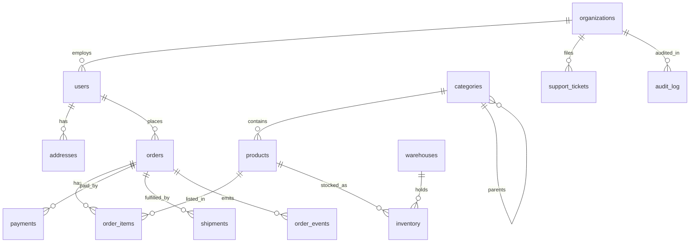

# Production e-commerce walkthrough

<Note>This is the flagship end-to-end build: every statement below runs on v0.1.0 — a complete order platform with domain model, real transactions, bulk seeding, dashboards, and integrity checks.</Note>

## Domain map



## 1. Domain model — composite keys, references, CHECK enums, arrays, JSONB

```sql
CREATE TABLE organizations (
  organization_id INTEGER PRIMARY KEY,
  organization_name TEXT NOT NULL UNIQUE,
  plan TEXT NOT NULL DEFAULT 'standard',
  country TEXT NOT NULL,
  created_at TIMESTAMP NOT NULL,
  CHECK (plan IN ('free', 'standard', 'enterprise'))
);
CREATE TABLE users (
  user_id INTEGER PRIMARY KEY,
  organization_id INTEGER NOT NULL REFERENCES organizations(organization_id),
  email TEXT NOT NULL UNIQUE,
  display_name TEXT NOT NULL,
  role TEXT NOT NULL,
  active BOOLEAN NOT NULL DEFAULT TRUE,
  created_at TIMESTAMP NOT NULL,
  CHECK (role IN ('owner', 'admin', 'member', 'viewer'))
);
CREATE TABLE products (
  product_id INTEGER PRIMARY KEY,
  category_id INTEGER NOT NULL REFERENCES categories(category_id),
  sku TEXT NOT NULL UNIQUE,
  product_name TEXT NOT NULL,
  unit_price NUMERIC(12,2) NOT NULL,
  metadata JSONB, tags TEXT[],
  created_at TIMESTAMP NOT NULL,
  CHECK (unit_price >= 0)
);
CREATE TABLE inventory (
  warehouse_id INTEGER NOT NULL REFERENCES warehouses(warehouse_id),
  product_id INTEGER NOT NULL REFERENCES products(product_id),
  quantity INTEGER NOT NULL,
  reserved INTEGER NOT NULL DEFAULT 0,
  PRIMARY KEY (warehouse_id, product_id),   -- composite table-level key
  CHECK (quantity >= 0), CHECK (reserved <= quantity)
);
```

<Warning>`REFERENCES …` parses and documents intent, but foreign keys are **not enforced** in v0.1.0. `PRIMARY KEY`, `UNIQUE`, and `CHECK` **are** enforced. Enforce references with the anti-join checks in §7.</Warning>

Indexes (single + composite, all supported):

```sql
CREATE INDEX idx_orders_user ON orders(user_id);
CREATE INDEX idx_events_order_time ON order_events(order_id, event_time);
CREATE INDEX idx_tickets_org_status ON support_tickets(organization_id, status);
```

## 2. Real order transaction — six tables, one COMMIT

```sql
BEGIN;
INSERT INTO orders (...) VALUES (1001, 1, 1, 'pending', 'USD', 1778.24, ...);
INSERT INTO order_items (...) VALUES
  (1, 1001, 1, 1, 1499.00, 0, '{"line":"laptop"}'),
  (2, 1001, 3, 1, 129.00, 0, '{"line":"keyboard"}');
UPDATE inventory SET quantity = quantity - 1, reserved = reserved + 1
  WHERE warehouse_id = 3 AND product_id IN (1, 3);
INSERT INTO payments (...) VALUES (5001, 1001, 'stripe', 'PAY-PLOMID-1001', 'paid', 1778.24, ...);
UPDATE orders SET order_status = 'paid' WHERE order_id = 1001;
INSERT INTO order_events (...) VALUES
  (9001, 1001, 'created', ..., '{"status":"pending"}', 1),
  (9002, 1001, 'paid', ..., '{"status":"paid","amount":1778.24}', 1);
COMMIT;
```

Lifecycle is just ordered `UPDATE`s: `pending → paid → processing → shipped → delivered`, with `shipments` rows and `delivered_at` filled as the parcel moves.

## 3. Rollback integrity + savepoint truth

```sql
BEGIN;
INSERT INTO orders (...) VALUES (1099, ...);
INSERT INTO order_items (...) VALUES (99, 1099, ...);
ROLLBACK;
SELECT COUNT(*) FROM orders WHERE order_id = 1099;  -- 0. Nothing leaked.
```

<Warning>Standalone `SAVEPOINT name;` is **not a statement** in v0.1.0 (parse error). `ROLLBACK [TO [SAVEPOINT] name]` parses but the name is swallowed — it performs a **full rollback**, not a partial one. Design transactions to be retryable from the start instead of relying on partial rollback.</Warning>

## 4. Bulk seeding — INSERT…SELECT with generate_series, CASE, interval math

```sql
INSERT INTO users (user_id, organization_id, email, display_name, role, active, created_at)
SELECT 1000 + g,
  100 + ((g - 1) % 100) + 1,
  'user' || g || '@production.example',
  'Production User ' || g,
  CASE WHEN g % 20 = 0 THEN 'admin' WHEN g % 7 = 0 THEN 'viewer' ELSE 'member' END,
  CASE WHEN g % 31 = 0 THEN FALSE ELSE TRUE END,
  '2026-06-02 09:00:00'::timestamp + (g || ' minutes')::interval
FROM generate_series(1, 1000) AS g;

INSERT INTO order_items (order_item_id, order_id, product_id, quantity, unit_price, discount, metadata)
SELECT 10000 + g, 2000 + ((g - 1) % 1000) + 1, ((g - 1) % 12) + 1,
  ((g - 1) % 4) + 1, p.unit_price,
  CASE WHEN g % 13 = 0 THEN 10.00 ELSE 0.00 END,
  json_build_object('batch', 'production', 'line', g)::jsonb
FROM generate_series(1, 4000) AS g
JOIN products p ON p.product_id = ((g - 1) % 12) + 1;   -- JOIN inside INSERT source
```

Patterns: `||` string building, `(g || ' hours')::interval` dynamic intervals, `json_build_object(…)::jsonb` per-row metadata, modulo sharding across parents.

## 5. Dashboards and reconciliation

```sql
-- org dashboard: FILTER aggregates + HAVING + ordered LIMIT
SELECT o.organization_id, COUNT(*) AS order_count, SUM(o.order_total) AS gross_value,
  AVG(o.order_total) AS average_order_value
FROM orders o WHERE o.order_status <> 'cancelled'
GROUP BY o.organization_id HAVING COUNT(*) >= 5 ORDER BY gross_value DESC LIMIT 20;

-- totals reconciliation via UPDATE…FROM a derived table (autocommit only)
UPDATE orders o
SET subtotal = x.subtotal, tax = ROUND(x.subtotal * 0.10, 2),
  shipping_fee = CASE WHEN x.subtotal < 500 THEN 25 ELSE 0 END,
  discount = x.discount,
  order_total = x.subtotal + ROUND(x.subtotal * 0.10, 2)
    + CASE WHEN x.subtotal < 500 THEN 25 ELSE 0 END - x.discount
FROM (SELECT order_id, SUM(quantity * unit_price) AS subtotal, SUM(discount) AS discount
      FROM order_items GROUP BY order_id) x
WHERE o.order_id = x.order_id;

-- multi-CTE account health report with LEFT JOINs + CASE segmentation
WITH organization_revenue AS (
  SELECT o.organization_id,
    SUM(o.order_total) FILTER (WHERE o.order_status <> 'cancelled') AS revenue,
    COUNT(*) FILTER (WHERE o.order_status <> 'cancelled') AS successful_orders
  FROM orders o GROUP BY o.organization_id),
organization_support AS (
  SELECT organization_id, COUNT(*) AS tickets,
    COUNT(*) FILTER (WHERE priority IN ('high', 'urgent')) AS critical_tickets
  FROM support_tickets GROUP BY organization_id)
SELECT org.organization_name, org.plan,
  COALESCE(r.revenue, 0) AS revenue, COALESCE(s.tickets, 0) AS tickets,
  CASE WHEN COALESCE(s.critical_tickets,0) > 10 AND COALESCE(r.revenue,0) > 10000 THEN 'HIGH_VALUE_HIGH_SUPPORT'
       WHEN COALESCE(r.revenue,0) > 10000 THEN 'HIGH_VALUE' ELSE 'NORMAL' END AS account_state
FROM organizations org
LEFT JOIN organization_revenue r ON r.organization_id = org.organization_id
LEFT JOIN organization_support s ON s.organization_id = org.organization_id
ORDER BY revenue DESC;
```

## 6. Views for stable read APIs

```sql
CREATE VIEW organization_order_summary AS
SELECT o.organization_id, org.organization_name, COUNT(o.order_id) AS order_count,
  COALESCE(SUM(o.order_total), 0) AS total_value
FROM organizations org LEFT JOIN orders o ON o.organization_id = org.organization_id
GROUP BY o.organization_id, org.organization_name;
SELECT * FROM organization_order_summary WHERE order_count > 0 ORDER BY total_value DESC;
```

## 7. Integrity without enforced FKs — anti-join checks

```sql
SELECT COUNT(*) AS orphan_orders FROM orders o
LEFT JOIN organizations org ON org.organization_id = o.organization_id
WHERE org.organization_id IS NULL;   -- expect 0; alert if not
SELECT COUNT(*) AS mismatches FROM (
  SELECT o.order_id, o.subtotal + o.tax + o.shipping_fee - o.discount AS expected_total, o.order_total
  FROM orders o) x
WHERE ROUND(expected_total, 2) <> ROUND(order_total, 2);
SELECT 'orders' AS entity, COUNT(*) FROM orders
UNION ALL SELECT 'users', COUNT(*) FROM users
UNION ALL SELECT 'products', COUNT(*) FROM products;   -- entity census
```

Run §7 on a schedule. It replaces what `REFERENCES` would guarantee elsewhere.

**Next:** [Complex queries](/v0.1.0/cookbook/complex-queries) · [Run transactions](/v0.1.0/build/run-transactions) · [What to build](/v0.1.0/cookbook/what-to-build)
