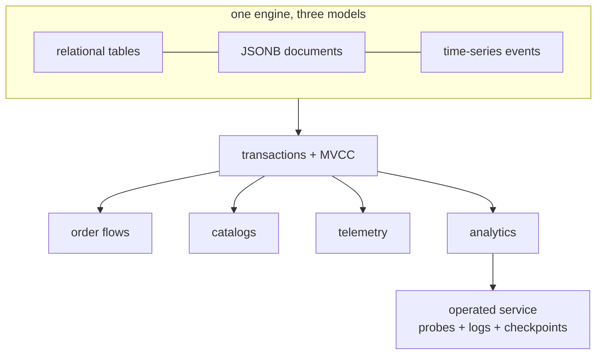

# What can I build?

Only combinations verified against the implementation. No marketing claims.

## Transactional order flow

`CREATE TABLE` + constraints + `ON CONFLICT` idempotent inserts + `BEGIN…COMMIT` multi-row writes + `RETURNING` echo + `EXPLAIN ANALYZE` validation. See [Run transactions](/v0.1.0/build/run-transactions).

## Document + relational catalog

`JSONB` payloads + `->>/@>/JSON_TABLE` queries + expression index on hot path + relational joins for ownership. See [Query JSON](/v0.1.0/build/query-json).

## Event / telemetry windows

`TIMESTAMPTZ` events + `ts` index + `now() - INTERVAL` windows + `date_trunc` rollups + `FILTER` aggregates + keyset pagination. No continuous aggregates in v0.1.0 — roll up on read. See [Query time](/v0.1.0/build/query-time).

## Indexed analytics

Selective `WHERE` + `GROUPING SETS/ROLLUP` + `string_agg/array_agg/json_agg` + `ORDER BY … LIMIT`. Verify with `EXPLAIN (ANALYZE)`.

## Operated service

`start.sh`/Docker + `db readiness/health/diagnostics` probes + structured logs + checkpoint tuning + `benchmark run` regression checks. See [Operations](/v0.1.0/operations/run-server).
