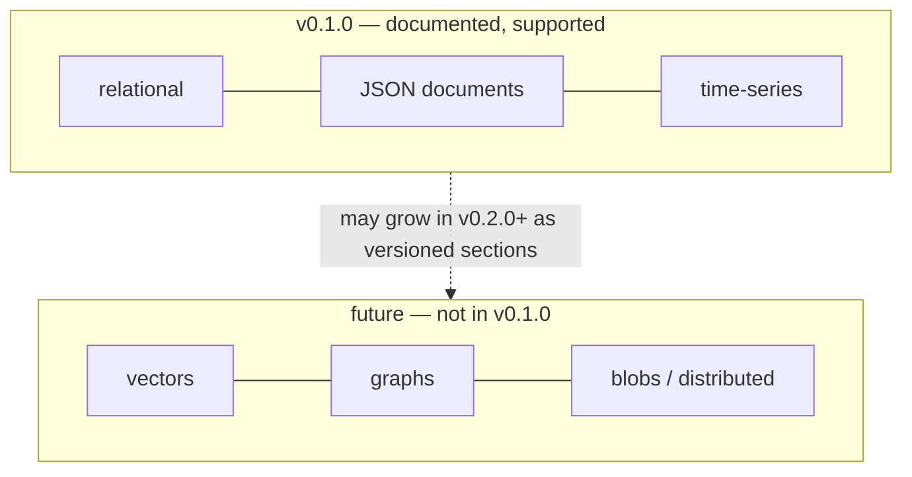

# Future data models — VECTOR and GRAPH

<Warning>**NOT AVAILABLE in v0.1.0. Roadmap firewall:** a mention here is not a promise of syntax, timeline, or compatibility. This page exists so CTOs/architects are never misled. Do not build on it.</Warning>



## VECTOR (not available)

| Question | Answer |
|---|---|
| Vector column type? | No. No `vector(n)`, no `halfvec`, no sparse type. |
| Distance operators (`<->`, `<#>`, `<=>`)? | No. `query/vector.rs` is columnar aggregate planning, not pgvector. |
| ANN/HNSW/IVF indexes? | No. |
| What you CAN do today | Store embeddings as `JSONB` arrays or `FLOAT8[]`; fetch candidates with relational filters; compute distance client-side or with scalar math per row (no index acceleration). |

```sql
-- TODAY (no vector index; full scan + client-side ranking):
CREATE TABLE docs (id BIGINT PRIMARY KEY, emb JSONB);
SELECT id FROM docs WHERE (emb->>'dim')::int = 1536 LIMIT 100;
```

## GRAPH (not available)

| Question | Answer |
|---|---|
| Node/edge tables, `MATCH`, traversals? | No. No graph DDL, no path queries, no traversal executor. |
| What you CAN do today | Model adjacency relationally (`edges(src, dst)` + recursive CTEs for bounded hops). |

```sql
-- TODAY: bounded hops with RECURSIVE (relational, unindexed-traversal):
WITH RECURSIVE hops(n, d) AS (
  SELECT 1, 0 UNION SELECT e.dst, h.d+1 FROM edges e JOIN hops h ON e.src = h.n WHERE h.d < 3
) SELECT * FROM hops;
```

## BLOBS / multi-region / distributed

Also not in v0.1.0: no blob type, no multi-region, no distributed deployment. Single-node server + WAL + checkpoints only.

**When these land:** they will appear as versioned sections (`v0.2.0/...`) with ADDED/CHANGED tables. v0.1.0 pages will not be rewritten.
