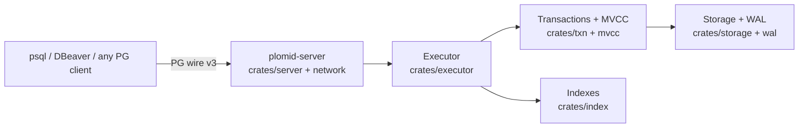

# What is PLOMID?

PLOMID is a database engine written in Rust (`crates/*` workspace, `unsafe_code = "forbid"`). It owns its parser, planner surface, executor, MVCC, storage, WAL, and PostgreSQL-protocol frontend. It does not embed another database engine (`deny.toml` enforces this; see [Repo structure](/v0.1.0/contributing/repo-structure)).

## Mental model

A request moves: **parse (`crates/sql`) → execute (`crates/executor`) → transact (`crates/txn`, `crates/mvcc`) → index/storage (`crates/index`, `crates/storage`) → persist (WAL + checkpoint)**. Details: [Request lifecycle](/v0.1.0/architecture/request-lifecycle).

## What PLOMID is / is not (v0.1.0)

| PLOMID is | PLOMID is not |
|---|---|
| SQL database with relational + JSON + temporal data | PostgreSQL (only speaks its wire protocol) |
| Persistent engine with WAL + checkpoints + recovery | Distributed / multi-region system |
| Single-writer transactional engine with MVCC snapshots | Vector, graph, or blob store |
| Local-first server + native `plomid` CLI | Managed cloud service |

Evidence: workspace `Cargo.toml` (19 crates), `crates/optimizer/src/lib.rs` is a stub (no cost-based planner in v0.1.0 — `EXPLAIN` reports sequential scans), `crates/security` is foundations only (auth lives in `crates/network`).

## Data model in one paragraph

Databases contain schemas contain tables. Columns are PostgreSQL-typed (`int4`, `text`, `numeric`, `json`/`jsonb`, `timestamptz`, … — see [Types](/v0.1.0/data/types)). Rows are versioned by MVCC. Indexes (B-tree persistent, ART in-memory) accelerate equality, range, ordering, and uniqueness. JSON columns mix document and relational access in one query. Time columns use ordinary B-tree ordering plus zone-map/BRIN pruning on columnar data.

## Next steps

- [Installation](/v0.1.0/getting-started/installation) · [Quickstart](/v0.1.0/getting-started/quickstart)
- [Core concepts](/v0.1.0/learn/concepts) · [Data model](/v0.1.0/learn/data-model)
- [Architecture overview](/v0.1.0/architecture/overview)
