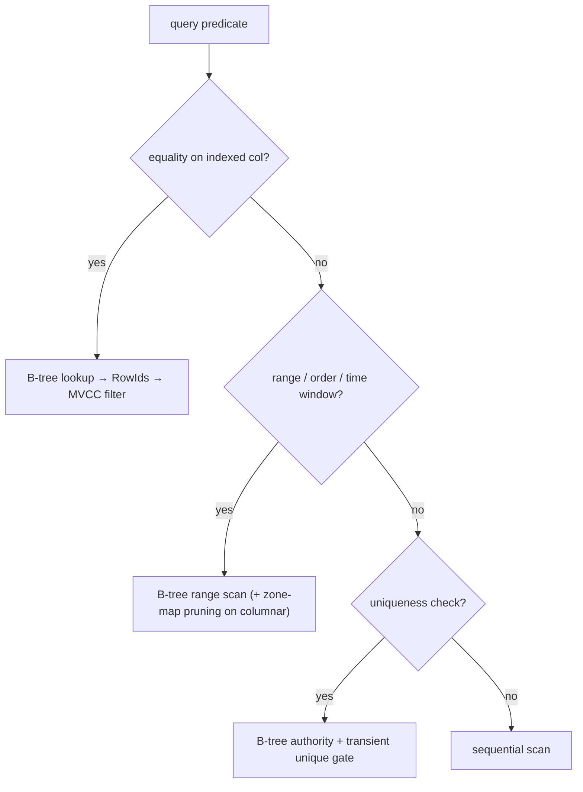

# Indexes



## Why

Tables are the authority; indexes are access paths for equality, range, ordering, time windows, and uniqueness. Without one, every predicate scans.

## Practical

```sql
CREATE INDEX orders_user_idx ON orders (user_id);
CREATE UNIQUE INDEX users_email_uidx ON users (email);
CREATE INDEX events_ts_idx ON events (ts);
CREATE INDEX recent_big ON orders ((total)) WHERE total > 100;  -- NO: partial predicates unsupported; use plain index
```

Correct expression form:

```sql
CREATE INDEX events_team_idx ON events ((payload->>'team'));
```

## What each serves

- **B-tree (persistent, `crates/index/src/btree/`)**: point equality, unique/PK enforcement (durable authority), ordered range/prefix scans, min/max bounds. 16 KiB pages + CRC + WAL replay (`ReplayTarget`), page0 `PLRT`. Generation-bound via `IndexGenerationStore`.
- **ART (in-memory, `crates/index/src/tree.rs`)**: `Unique|NonUnique` byte-key → `RowId` set; Node4/16/48/256 + path compression. No persistence/WAL/locks — caller serializes (`&mut`). `insert → DuplicateKey|AlreadyPresent`, `delete` prunes/merges. Keys are opaque bytes; executor encodes SQL → bytes (order-preserving `encode_i64_ordered` for numerics).

## What they don't do

No full-text, no vector KNN, no partial/expression-multi-column magic beyond single-expression keys, no planner cost choice in v0.1.0.

## Internals (for contributors)

`lookup → Vec<RowId>`, `range_scan(Bound)`, `lower/upper_bound`, `first/last`, `scan_all(_reverse)`, `build_bulk(sorted)`, `sync`, `stats/entry_count`. Unique reservation (`lock_unique`) is transient coordination only.

**Next:** [Create an index](/v0.1.0/build/create-index) · [Inspect a query](/v0.1.0/build/inspect-query)
