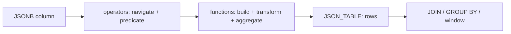

# JSON in PLOMID — overview

<Check>**Supported first-class data model** alongside relational and temporal. No separate document store. Storage: `json` (text) vs `jsonb` (canonical bytes). Engine: `crates/json` + `crates/types/src/jsonb.rs`.</Check>

<CardGroup cols={3}>
<Card title="Operators" icon="arrow-right-arrow-left" href="/v0.1.0/json/operators">`-> ->> #> #>> #- @> <@ ? ?| ?& @? @@`, subscripts, paths</Card>
<Card title="Functions" icon="code" href="/v0.1.0/json/functions">Every JSON function with signature + example</Card>
<Card title="JSON_TABLE" icon="table" href="/v0.1.0/json/table">Shred documents into rows</Card>
</CardGroup>

## Mental model



JSON values flow through ordinary SQL: filter (`@>`), project (`->>`), aggregate (`json_agg`), join on extracted keys, window over time. Missing field → SQL NULL (see [NULL](/v0.1.0/sql/null-semantics)).

## Quick taste

```sql
CREATE TABLE events (id BIGINT PRIMARY KEY, payload JSONB);
INSERT INTO events VALUES (1, '{"user":{"name":"ada"},"ok":true}');
SELECT payload->'user'->>'name' AS name FROM events WHERE payload @> '{"ok": true}';
SELECT json_agg(payload ORDER BY id) FROM events;
```

## For future VECTOR / GRAPH planners

Vector embeddings and graph traversals are **not in v0.1.0**. JSON arrays can hold embedding-like data today (`[0.1, 0.2]` + `jsonb_array_elements`), but there are no distance operators or indexes. See [Future data models](/v0.1.0/future/vector-graph) for the explicit firewall.

**Next:** [Operators](/v0.1.0/json/operators) → [Functions](/v0.1.0/json/functions) → [JSON_TABLE](/v0.1.0/json/table) → [Query JSON guide](/v0.1.0/build/query-json)
