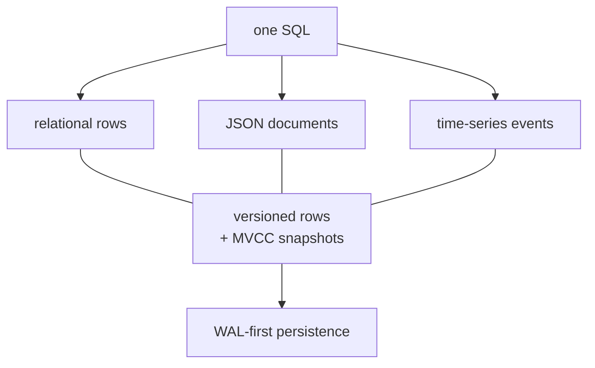

# Core concepts

## 1. Everything is SQL-first

SQL text → tokens (`crates/sql/src/lexer.rs`) → AST (`ast.rs`) → execution (`crates/executor`). There is no separate NoSQL API. JSON and time-series are column types and operators inside SQL, not side systems. See [Query pipeline](/v0.1.0/architecture/query-pipeline).

## 2. Data lives in versioned rows

Writes create row versions tagged with transaction ID + commit timestamp (`crates/mvcc`). Readers see a snapshot (`watermark + active set`). Your own writes are always visible to you; concurrent committed writes become visible according to snapshot rules. See [MVCC](/v0.1.0/transactions/mvcc).

## 3. Persistence is WAL-first

Every write is appended to the WAL (`PLW2` records) and fsync'd at commit before pages are updated. Checkpoints bound replay. After a crash, recovery replays strictly after the checkpoint boundary. See [WAL / checkpoints / recovery](/v0.1.0/storage/wal-checkpoints-recovery).

## 4. Indexes are access paths, not storage

Tables are the authority. B-tree indexes (persistent) enforce uniqueness and serve equality/range/order; in-memory ART indexes serve transient coordination. The v0.1.0 planner surface reports sequential scans via `EXPLAIN` — index usage is explicit in executor paths, not a cost-based choice. See [Indexes](/v0.1.0/indexes/overview).

## 5. Types are PostgreSQL-shaped

`int2/4/8`, `float4/8`, `numeric`, `text`/`varchar`, `bool`, `date`/`time`/`timestamptz`/`interval`, `uuid`, `json`/`jsonb`, arrays, `inet`, ranges, plus `serial` pseudo-types and user `ENUM`/`DOMAIN`/`composite`. OIDs match PostgreSQL 17 for wire compatibility. See [Types](/v0.1.0/data/types).

## 6. Errors are explicit

Parse errors (`crates/sql/src/parser/mod.rs:ParseError::Unsupported`), execution errors (`crates/executor/src/error.rs`), storage corruption (`ErrorKind::Corruption`), transaction conflicts (`ErrorKind::Transaction`/`Conflict`). No silent coercion surprises — see [Errors](/v0.1.0/reference/errors) and [NULL semantics](/v0.1.0/sql/null-semantics).

## Next

- [Data model](/v0.1.0/learn/data-model) · [SQL fundamentals](/v0.1.0/learn/sql-fundamentals) · [Learning paths](/v0.1.0/learn/learning-paths)
