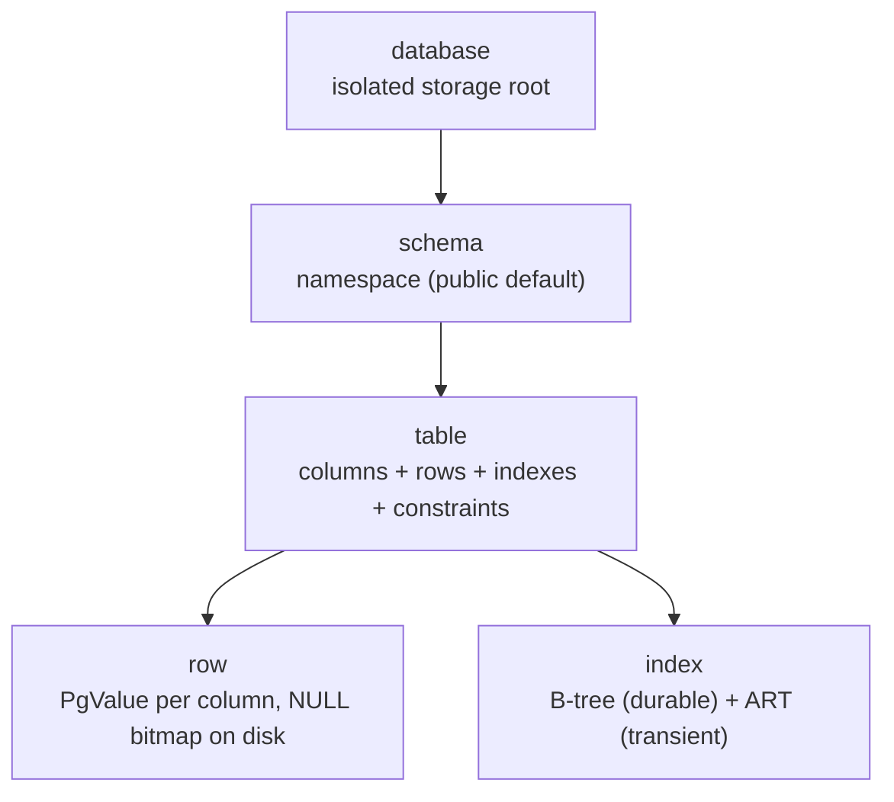

# Data model



## Hierarchy

```text
database
└── schema (public by default)
    └── table (columns + rows + indexes + constraints)
```

- **Database:** isolated storage root (see [First database](/v0.1.0/getting-started/first-database)).
- **Schema:** namespace; `search_path` resolves unqualified names (`"$user",public` default).
- **Table:** ordered column definitions + heap of versioned rows.
- **Row:** `PgValue` per column (`crates/types/src/value.rs`), NULL bitmap on disk (`crates/storage/src/row.rs`).

## Columns

```sql
CREATE TABLE products (
  id         BIGINT PRIMARY KEY,          -- integer + unique enforcement
  sku        TEXT NOT NULL UNIQUE,
  price      NUMERIC(12,2) NOT NULL DEFAULT 0.00,
  tags       TEXT[] ,                     -- array type
  spec       JSONB,                       -- document column
  created_at TIMESTAMPTZ NOT NULL DEFAULT now()
);
```

Column types: [Types](/v0.1.0/data/types). Constraints: [Constraints](/v0.1.0/data/constraints). `serial`/`bigserial` auto-create `<table>_<col>_seq` and mark `serial=true`.

## Identity and constraints

- `PRIMARY KEY` / `UNIQUE` → persistent B-tree + transient unique-gate reservation (durable authority is the index; see [Indexes](/v0.1.0/indexes/overview)).
- `NOT NULL`, `DEFAULT <expr>`, `CHECK (expr)` enforced at write time.
- Foreign keys parse in some DDL paths but are **not enforced** in v0.1.0 — see [Compatibility](/v0.1.0/sql/compatibility).

## Related

[Create a table](/v0.1.0/build/create-table) · [JSON](/v0.1.0/data/json) · [Temporal](/v0.1.0/data/temporal)
