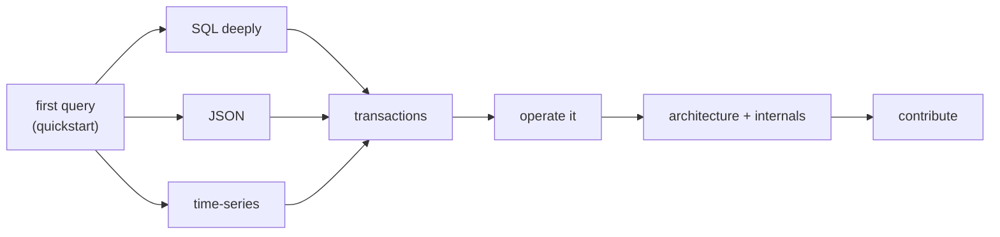

# Learning paths

## Path 1 — Build your first application

`Quickstart` → `Create a table` → `Insert data` → `Query data` → `Run transactions` → `Build an application`.

## Path 2 — Learn SQL deeply

`SQL fundamentals` → `SELECT` → `Joins` → `Subqueries + CTEs` → `Aggregates` → `NULL semantics` → `Compatibility` → `Complex queries` cookbook.

## Path 3 — Work with JSON

`Query JSON` guide → `JSON data` reference → `JSON cookbook` → `Indexes` (JSON + relational combos).

## Path 4 — Work with time-series data

`Query time` guide → `Temporal` reference → `Time cookbook` → `Columnar` internals (delta/bitpack for timestamps).

## Path 5 — Understand transactions

`Run transactions` → `MVCC` → `Behavior contracts` → `How a write works`.

## Path 6 — Operate PLOMID

`Run the server` → `Configuration` → `CLI` → `Logging & diagnostics` → `Troubleshooting`.

## Path 7 — Explore architecture

`Architecture overview` → `Request lifecycle` → `Query pipeline` → `How it works` → `Storage internals` → `Contribute`.

All paths converge on the [Cookbook](/v0.1.0/cookbook/overview) when you want combinations rather than single features.
