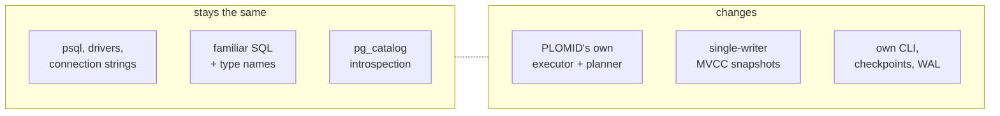

# Notes for PostgreSQL users

## Similar (verified)

- Wire protocol v3: `psql`, DBeaver, `psycopg`/`pg` drivers connect unchanged; simple + extended query, `$1` params, `pg_catalog`/`information_schema` introspection.
- Type names + OIDs mirror PG 17 (`int4=23`, `jsonb=3802`, …); `server_version 17.0`; familiar SQLSTATEs (`28P01`, `08P01`).
- `serial` sequences, `ENUM`/`DOMAIN`, `RETURNING`, `ON CONFLICT`, windows, CTEs, set ops.

## Different

- Engine is PLOMID's own: `EXPLAIN` shows scan shapes, no cost planner; `ILIKE` case-folding ignored single-table; `NULL AND TRUE → false` (is-true logic, not strict 3VL).
- Single-writer + MVCC snapshots; isolation options parse but don't select a PG isolation implementation.
- `FOREIGN KEY` unenforced; file `COPY` rejected; `UPDATE…FROM`/`COPY` not in explicit txns; `LIMIT/OFFSET` literal-only.
- Three password defaults exist (server `plomid`, CLI/start.sh `secret`) — set explicitly.
- TLS flags parse but handshake declined; binary wire values unsupported (text only).

## Assumptions to drop

`PostgreSQL-compatible` as a blanket claim; planner hints; procedural languages; replication/slots beyond catalog rows; performance parity numbers. When in doubt: [Compatibility](/v0.1.0/sql/compatibility).
