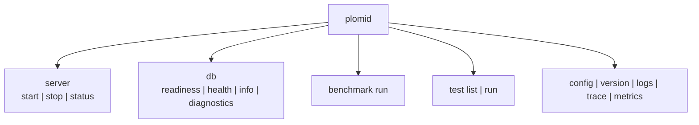

# Native `plomid` CLI

Build: `cargo build -p plomid-cli` → `./target/debug/plomid`. Shared connection flags on most commands: `--host/--port/--user/--password/--database/--data-dir` (env `PLOMID_*`, defaults `127.0.0.1/5432/plomid/secret/plomid/./data`).



```sh
./target/debug/plomid db readiness --port 5432 --json
./target/debug/plomid db health --port 5432
./target/debug/plomid db info --data-dir ./data
./target/debug/plomid db diagnostics --port 5432
./target/debug/plomid benchmark run --iterations 100 --port 5432
./target/debug/plomid server status --port 5432
./target/debug/plomid test list
./target/debug/plomid config --json
./target/debug/plomid version
```

- `server start`: creates data dir, refuses if `plomid.pid` exists, finds sibling `plomid-server`, spawns with env, writes pid. `server stop`: `kill -TERM` (Unix only). `server status`: 2 s TCP probe.
- `db readiness`: TCP → startup (`user/database/application_name=plomid-cli`) → `SELECT 1` must return `1`. Checks: Server/Network/Authentication/Database/Simple query/Read PASS-FAIL; Write + Transaction NOT SUPPORTED (non-destructive by design); Persistence WARNING. Exit 1 when not ready.
- `db health`: readiness + `database_bytes`. `db info`: local only (database/WAL bytes, catalog tables or `unavailable`). `db diagnostics`: readiness + data-dir configuration check + recommendations.
- `benchmark run --operation select --iterations 100 --concurrency 1`: loops `SELECT 1`; reports avg/p50/p95/p99/throughput; persists `<data_dir>/benchmarks/<run-id>.json`. Concurrency ≠ 1 errors; current operation is `SELECT 1` only.
- `test list|run`: `connectivity|read` delegate to readiness; `write/persistence/recovery/performance` report isolated-mode requirement.
- `logs|trace|metrics`: logging hints, traceability fields, probe-latency metrics (server counters `unavailable`).

CLI `WireClient` speaks simple `Q` only (no extended/SCRAM/MD5). Precise flags: [CLI reference](/v0.1.0/reference/cli-reference).
