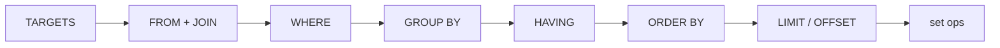

# SELECT

## Syntax (parse order in `crates/sql/src/parser/select.rs`)



```text
[WITH [RECURSIVE] cte,…]
SELECT [DISTINCT [ON (expr,… )]] target,…
[FROM relation,… | JOIN …]
[WHERE expr]
[GROUP BY expr,… | GROUPING SETS (…) | ROLLUP (…) | CUBE (…)]
[HAVING expr]
[ORDER BY expr [ASC|DESC] [NULLS FIRST|LAST],…]
[LIMIT n] [OFFSET n]
[FOR UPDATE]
[{UNION|INTERSECT|EXCEPT} [ALL] select]
```

## Targets

```sql
SELECT *;  SELECT users.*;  SELECT u.* FROM users u;
SELECT id, name AS n, total * 1.1 AS with_tax FROM orders;
SELECT count(*) FILTER (WHERE total > 100) FROM orders;
SELECT sum(total) OVER (PARTITION BY user_id ORDER BY placed_at) FROM orders;
SELECT 1 AS schema;   -- any keyword allowed as explicit AS alias
```

## FROM

```sql
FROM users, orders                       -- comma = CROSS
FROM users u JOIN orders o ON o.user_id = u.id
FROM users LEFT JOIN orders USING (id)
FROM (SELECT * FROM users) AS u(id, name)
FROM generate_series(1, 3) AS g(n) WITH ORDINALITY
FROM JSON_TABLE('…' , '$[*]' COLUMNS (a TEXT PATH '$.a')) AS jt
```

`USING(a,b)` rewrites to `L.a=R.a AND …`. Parenthesised joins need an alias (default `__anon`). `LATERAL` explicit or implicit when RHS references outer columns.

## Filtering / grouping / ordering / pagination

```sql
SELECT user_id, count(*), sum(total)
FROM orders WHERE total > 0
GROUP BY user_id HAVING count(*) > 1
ORDER BY sum(total) DESC NULLS LAST
LIMIT 20 OFFSET 40;
-- grouping sets / rollup / cube normalize to sets:
SELECT a, b, count(*) FROM t GROUP BY GROUPING SETS ((a,b),(a),());
SELECT a, b, count(*) FROM t GROUP BY ROLLUP (a, b);
```

`LIMIT`/`OFFSET` accept only `Int2/4/8` literals or casts. `FOR UPDATE` parses, ignored (single-writer serialization).

## Set operations

```sql
SELECT id FROM a UNION SELECT id FROM b;
SELECT id FROM a INTERSECT ALL SELECT id FROM b;
SELECT id FROM a EXCEPT SELECT id FROM b;
```

Equal arity required; single-level left-assoc.

## Behavior

- Empty input → zero rows. `SELECT` without `FROM` evaluates expressions.
- Ambiguous bare column → error. `SELECT *` expands in join order.
- `needs_general_engine`: `string_agg/array_agg/json_*agg`, non-`ColumnRef` GROUP BY, multi-sets, or GROUP BY+ORDER BY route to the general join engine.

## Constraints

- `ILIKE` parses but case-folding is ignored in the single-table path (behaves as `LIKE`).
- Deeply nested subqueries guarded by `MAX_SUBQUERY_DEPTH`.

**Related:** [Joins](/v0.1.0/sql/joins) · [Aggregates](/v0.1.0/sql/aggregates) · [Subqueries + CTEs](/v0.1.0/sql/subqueries-cte) · [EXPLAIN](/v0.1.0/sql/explain)
