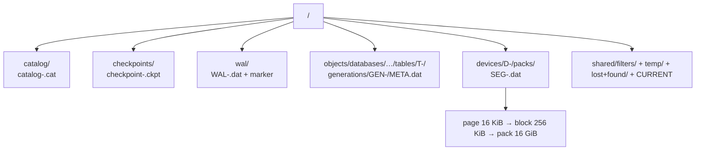

# Storage developer guide

## Where data goes



```
<root>/catalog/catalog-<gen:020>.cat
<root>/checkpoints/checkpoint-<gen:020>.ckpt
<root>/wal/WAL-<seq:012>.dat + checkpoint marker
<root>/objects/databases/…/tables/T-<id>/generations/GEN-<gen>/META.dat
<root>/devices/D-<id>/packs/SEG-<id>.dat
<root>/shared/filters/  temp/  lost+found/  CURRENT
```

`DatabaseLayout` is pure path algebra (`crates/storage/src/layout/root.rs`). No manifest: device `packs/` listing + `DeviceRegistry` is the durable inventory.

## What survives restart (supported)

- Committed transactions (WAL-durable before visibility).
- Catalog generations (staged `.tmp` + atomic rename; corrupt generations skipped; `CURRENT` is authority).
- Segments/packs/blocks/pages (CRC-verified; corrupt → `Corruption`, not silent data).
- Checkpoints bound replay; WAL marker is the boundary in KV deployment.

## Sizes (constants)

`PAGE 16 KiB` (48 B header + payload + 4 B trailer), `BLOCK 256 KiB = 16 pages`, `EXTENT 64 MiB`, `PACK target 16 GiB`, `COLUMNAR_CHUNK 16 MiB`, default segment/WAL segment `8 MiB`.

## What developers must do

Nothing special: commit and it persists. `sync` flushes buffer pool + fsync. For operations (checkpoint policy, reclaim, orphan GC): [WAL / checkpoints / recovery](/v0.1.0/storage/wal-checkpoints-recovery). For layout details: [Engine internals](/v0.1.0/storage/engine-internals).
