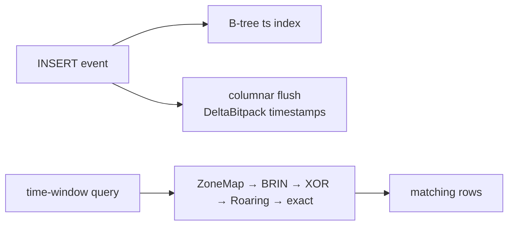

# Time-series in PLOMID — overview

<Note>**No dedicated time-series engine** in v0.1.0: no hypertables, continuous aggregates, retention, or downsampling. Time-series = temporal columns + SQL + `ts` indexes + columnar `DeltaBitpack/Rle` + zone-map/BRIN pruning. Anything beyond that is roadmap.</Note>

<CardGroup cols={2}>
<Card title="Query patterns" icon="chart-line" href="/v0.1.0/timeseries/queries">Windows, rollups, FILTER aggregates, keyset feeds</Card>
<Card title="Temporal reference" icon="clock" href="/v0.1.0/data/temporal">Literals, arithmetic, EXTRACT, precision</Card>
</CardGroup>

## Model

```sql
CREATE TABLE events (
  id BIGINT PRIMARY KEY,
  ts TIMESTAMPTZ NOT NULL,
  kind TEXT NOT NULL,
  payload JSONB
);
CREATE INDEX events_ts_idx ON events (ts);
```

One row per event, `ts` indexed, hot JSON dimensions in `payload`. Columnar flush encodes timestamp runs (`DeltaBitpack`) and sorted keys (`Rle`); scans prune by `ZoneMap → BRIN → XOR → Roaring → exact`.



## What works / what doesn't

| Need | v0.1.0 |
|---|---|
| Insert events, query windows, order, aggregate | Supported |
| `date_trunc` rollups, `FILTER` splits | Supported |
| Retention/downsampling/continuous agg | Not available — roll up on read or delete old partitions manually |
| Gap-filling / interpolation | Not available — outer-join a `generate_series` calendar (see queries) |

## Related

[Query time guide](/v0.1.0/build/query-time) · [Indexes](/v0.1.0/indexes/overview) · [Columnar](/v0.1.0/storage/columnar)
