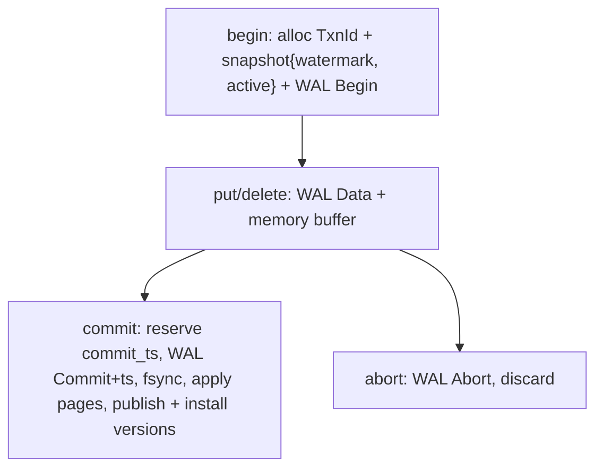

# MVCC

**Status:** Supported (`crates/mvcc`). Classification: snapshot semantics below are **supported behavior**; chain/GC numbers are **implementation details**.

## Model

`RowVersion{creator:TxnId, commit_ts, state: Live|Deleted|Uncommitted|Invisible, payload, prev}` (`version.rs`). Envelope `0x56|state|creator|ts|payload` (`codec.rs`).

`is_version_visible(v, snap)`: own `creator == owner` always visible; `Uncommitted/Invisible` or `commit_ts=None` never; else `!snap.is_active(creator) && commit_ts <= watermark`, where `Snapshot{owner, watermark=last_committed, active: BTreeSet − owner}`.

## Store

`VersionStore: BTreeMap<key, Vec<RowVersion>>` newest-first (`store.rs`): `install` (committed only, bumps `last_committed`), `ensure_bootstrap` as `TxnId(0),ts0` for pre-MVCC rows, `visible / visible_or_unknown` (None→storage fallback, Some(None)→deleted), `scan_visible`, paged `scan_step/count_step`, `gc(horizon)` keeping uncommitted + `ts>horizon` + newest `ts<=horizon` floor. `gc_horizon = min(active) else last`.

Engine owns `SharedVersionStore (Arc<Mutex>)` + `versions_complete` (mount-time `bootstrap_versions` full scan; maintained by `install_committed`). Reads page in `SCAN_CHUNK_ROWS=1024` chunks under a fixed snapshot.

## What you can rely on

- Read-your-own-writes within a transaction (pending overlay on scans).
- Repeatable snapshot within a read path; concurrent commits don't rewrite your snapshot mid-scan.
- Other transactions' buffered (uncommitted) writes invisible.

**Related:** [Behavior contracts](/v0.1.0/transactions/behavior-contracts) · [How a write works](/v0.1.0/architecture/how-it-works)
