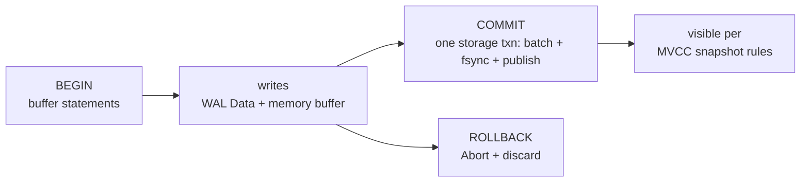

# Using transactions



See [Run transactions](/v0.1.0/build/run-transactions) for the task guide. This page is the precise reference.

```text
BEGIN [TRANSACTION|WORK] [ISOLATION LEVEL …|READ ONLY|…]
START TRANSACTION […] | SET [SESSION|LOCAL] TRANSACTION … | SET … CHARACTERISTICS …
COMMIT [opts] | ROLLBACK [TO [SAVEPOINT] name] [opts]
```

- `execute_all` splits batches depth-aware on `;`; `BEGIN` buffers into `pending`; `COMMIT|ROLLBACK` runs `execute_transaction_group` as one storage txn.
- In-txn writes allowed: `INSERT/UPDATE/DELETE` + `CREATE TABLE|VIEW`. `COPY` and `UPDATE…FROM` in-txn → `Unsupported`.
- `SET search_path` in-batch affects later statements.
- `preview_dml_count` / `validate_dml_strict` cover staged DML; maintenance accounting runs only after committed writes.

Isolation options parse but the engine is single-writer with MVCC snapshots (see [MVCC](/v0.1.0/transactions/mvcc)); there is no multi-writer serializable scheduler to tune in v0.1.0.
