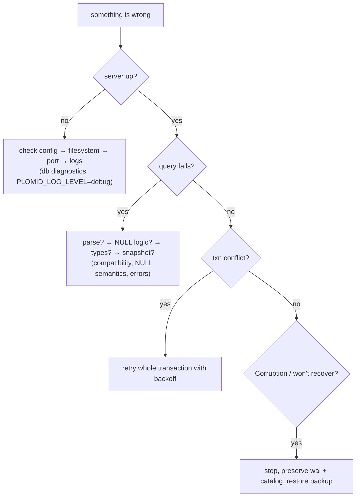

# Troubleshooting



## PLOMID will not start → check config → filesystem → port → logs

```sh
./target/debug/plomid db diagnostics --port 5432
PLOMID_LOG_LEVEL=debug ./start.sh
```

- `authentication cannot be disabled on non-loopback` → use loopback or set `--auth` + TLS/opt-in.
- `non-loopback binds require TLS` → pass `--allow-remote-plaintext` (dev only).
- `tls_requires_cert_and_key` → supply both or drop `--tls`.
- Port in use → change `--port`/`PLOMID_PORT`.
- Missing/wrong data dir → check `PLOMID_DATA_DIR`, `fs::metadata` step in diagnostics.

## Queries fail → check SQL → NULL → types → visibility

- Parse `Unsupported` → compare against [Compatibility](/v0.1.0/sql/compatibility).
- Zero rows unexpectedly → `WHERE NULL`? `= NULL` instead of `IS NULL`? snapshot isolation? See [NULL](/v0.1.0/sql/null-semantics).
- `LIMIT 'x'` fails → use integer literal or cast.
- Ambiguous column → qualify (`u.id`).
- `UPDATE…FROM`/txn error → move to autocommit.

## Transactions conflict → retry

`Conflict` (lane/unique) → retry the whole transaction with backoff. Unclosed `BEGIN` → always pair with `COMMIT`/`ROLLBACK`. Lone `COMMIT` no-op is normal, not data loss.

## Storage / recovery → do not ignore Corruption

`Corruption` (checksum/gap/version) → stop, preserve `<root>/wal` + `catalog/`, restore from backup, rerun recovery. Check `CURRENT`, latest `catalog-*.cat`, contiguous `WAL-*.dat`. See [WAL / recovery](/v0.1.0/storage/wal-checkpoints-recovery) and [Errors](/v0.1.0/reference/errors).
